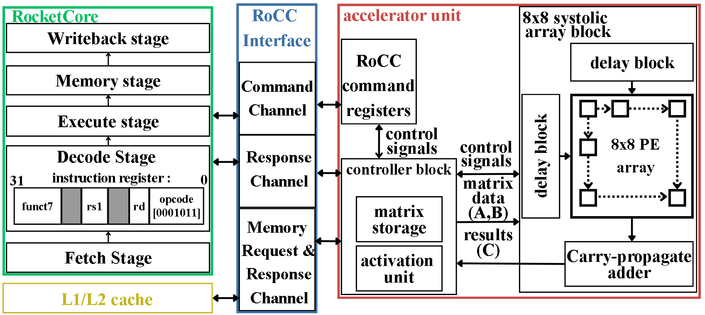
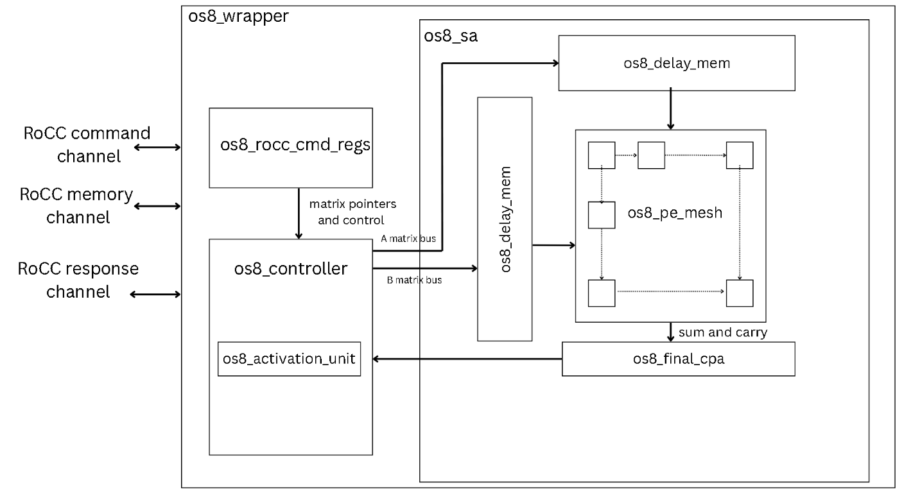

# Background and Architecture

## 1. Why Accelerate Matrix Multiplication?

Modern AI workloads contain large numbers of repeated multiply-and-accumulate (MAC) operations. These operations form the main computation in matrix multiplication and fully connected neural-network layers, while convolution operations can also be transformed into matrix-multiplication-style workloads.

For matrix multiplication:


each output element is calculated as the dot product between one row of matrix A and one column of matrix B.

General-purpose processors can execute these operations, but repeated instruction handling, complex memory hierarchies and data movement introduce overhead. A domain-specific accelerator can instead map the regular MAC structure directly into hardware and execute many operations in parallel.

Systolic arrays are particularly suitable for this because they combine:

- regular computation,
- high parallelism,
- local communication between neighbouring processing elements,
- predictable data movement,
- data reuse as operands move through the array.

---

## 2. Systolic Array Dataflows

A systolic array consists of a regular grid of processing elements (PEs). Each PE performs arithmetic on incoming operands and passes data to neighbouring PEs in a controlled pattern.


Different systolic-array dataflows determine which values remain inside the PEs and which values move through the array.

| Dataflow | Stationary value | Main advantage |
|---|---|---|
| Output stationary | Partial sum / output | Reduces partial-sum movement |
| Weight stationary | Weight | Maximises weight reuse |
| Input stationary | Input activation | Maximises input reuse |

There is no universally optimal dataflow. The most suitable organisation depends on the workload and on which type of data is reused most frequently.

---

## 3. Output-Stationary Systolic Array

The accelerator in this project uses an **output-stationary (OS)** dataflow.

Recall that each matrix-multiplication output is calculated as

$$
C_{ij} = \sum_{k=1}^{m} A_{ik}B_{kj}
$$

where $C_{ij}$ is formed by multiplying the corresponding elements of row $i$ of matrix A and column $j$ of matrix B, then accumulating the products over $k$.

In an output-stationary systolic array, each PE is associated with one output element $C_{ij}$. During the main compute phase, the partial sum for that output remains associated with the same PE while the A and B operands move through the array.


The figure illustrates the operation using a 4×4 example.

The **blue A values** enter from the left side of the array and propagate horizontally from PE to PE. The **red B values** enter from the top and propagate vertically down the PE columns.

For each PE, the corresponding A and B operands arrive over successive clock cycles. Whenever a matching pair reaches the PE, the two operands are multiplied and the product is added to the partial sum already stored for that output.

For example, the PE responsible for $C_{11}$ computes

$$
C_{11}
=
A_{11}B_{11}
+
A_{12}B_{21}
+
A_{13}B_{31}
+
A_{14}B_{41}
$$

The four products do not enter the PE simultaneously. Instead, they arrive over successive cycles:

```text
A11 meets B11  → accumulate A11 × B11
A12 meets B21  → accumulate A12 × B21
A13 meets B31  → accumulate A13 × B31
A14 meets B41  → accumulate A14 × B41
```

After the final pair has been processed, the accumulated value represents the completed $C_{11}$ result.

The same operation takes place simultaneously across the other PEs. For example:

```text
C12 = A11B12 + A12B22 + A13B32 + A14B42
C21 = A21B11 + A22B21 + A23B31 + A24B41
C44 = A41B14 + A42B24 + A43B34 + A44B44
```

The dashed timing lines in the figure show that different rows of A and columns of B are injected at different times. This deliberate staggering ensures that operands with the same $k$ index meet at the correct PE during the same cycle.

The resulting computation moves through the array as a diagonal **systolic wavefront**.

The defining behaviour of the output-stationary dataflow is therefore:

- A values move horizontally,
- B values move vertically,
- each PE accumulates one output $C_{ij}$,
- the partial output remains local during the main compute phase.

This reduces partial-sum movement because intermediate output values do not need to travel between PEs during every MAC operation.

In OS8, this same principle is applied across an 8×8 PE array. The main architectural difference from a simple textbook OS PE is that OS8 maintains the accumulated value internally in **carry-save form**. After the MAC phase is complete, the sum and carry values are propagated toward the bottom of the array and converted into conventional 32-bit results by the final carry-propagate adder stage.

---

## 4. Overall System Architecture

The accelerator is integrated with a RISC-V RocketCore through the **Rocket Custom Coprocessor (RoCC)** interface.

The complete system contains:

- RocketCore,
- cache and memory hierarchy,
- RoCC interface,
- OS8 accelerator.



RocketCore remains responsible for general program execution and workload orchestration.

This includes tasks such as:

- preparing matrix data,
- dividing larger matrices into 8×8 tiles,
- zero-padding incomplete tiles,
- configuring the accelerator,
- issuing accelerator commands,
- combining results across multiple tile operations.

OS8 performs the hardware matrix-multiplication kernel.

The RoCC interface provides the control path between RocketCore and the accelerator, while accelerator memory requests access matrix data through the system memory hierarchy.

This separates the system into two main roles:

```text
RocketCore / Software
        │
        │  workload scheduling
        │  tiling and zero-padding
        │  accelerator commands
        ▼
      RoCC
        │
        ▼
OS8 Accelerator
        │
        │  data loading
        │  systolic computation
        │  output processing
        ▼
      Memory
```

---

## 5. OS8 Hardware Hierarchy

The SystemVerilog accelerator is organised as:

```text
os8_wrapper
├── os8_rocc_cmd_regs
├── os8_controller
│   └── os8_activation_unit
└── os8_sa
    ├── os8_delay_mem ×2
    ├── os8_pe_mesh
    │   └── os8_pe ×64
    └── os8_final_cpa ×8
```



### `os8_wrapper`

`os8_wrapper` is the top-level SystemVerilog boundary of the accelerator.

It connects the external RoCC-facing interface to the internal accelerator hardware.

The wrapper handles connections for:

- RoCC command signals,
- RoCC response signals,
- memory requests,
- memory responses,
- accelerator busy status.

It primarily acts as an integration layer between RocketCore/RoCC and the internal command, controller and compute modules.

---

### `os8_rocc_cmd_regs`

`os8_rocc_cmd_regs` receives the decoded RoCC command fields and stores the configuration required by the accelerator.

It maintains:

- A matrix pointer,
- B matrix pointer,
- C output pointer,
- response destination register,
- ReLU enable,
- output shift amount,
- operating mode.

It also generates a one-cycle `start_pulse` when an execution command is accepted.

The operating mode allows the memory-load, compute and store stages to be invoked either together or separately.

This is important for data reuse because a previously loaded operand can remain resident while another operand is replaced.

---

### `os8_controller`

`os8_controller` is the main system-level sequencer of the accelerator.

It controls the complete execution sequence, including:

- loading matrix A,
- loading matrix B,
- retaining loaded A and B tiles,
- starting the systolic-array core,
- waiting for computation to finish,
- selecting computed C elements,
- sending results through the activation unit,
- writing C back to memory,
- generating the RoCC response,
- collecting execution-cycle information.

The ability to separate loading, computation and storage allows the accelerator to reuse previously loaded matrices across multiple operations.

The `os8_activation_unit` is instantiated inside the controller and is used during the output-store path.

---

### `os8_activation_unit`

`os8_activation_unit` performs optional output post-processing before a computed result is written to memory.

It first applies an arithmetic right shift:

```text
shifted = in_data >>> shift_amount
```

If ReLU is enabled and the shifted result is negative:

```text
out_data = 0
```

Otherwise:

```text
out_data = shifted
```

The resulting value is returned to the controller and packed into the memory-store data.

---

### `os8_sa`

`os8_sa` is the main systolic-array compute core.

It:

- receives complete 8×8 A and B tiles from the controller,
- transposes B internally,
- feeds A and transposed B through staggered delay memories,
- generates the systolic wavefront,
- controls the 8×8 PE mesh,
- performs carry-save result propagation,
- converts carry-save outputs using the final CPA stage,
- produces the output matrix C,
- asserts `done` when the tile computation is complete.

---

## 6. Generating the Systolic Wavefront

Correct systolic operation requires the appropriate A and B operands to reach each PE during the same clock cycle.

If all rows of A and columns of B were injected simultaneously without any delay, operands belonging to different values of $k$ would meet at many PEs.

OS8 therefore uses two `os8_delay_mem` instances:

- one for matrix A,
- one for the internally transposed matrix B.

Each row is given an increasing initial delay.

Conceptually, the A stream behaves as:

```text
A row 0:  A00 A01 A02 A03 ...
A row 1:      A10 A11 A12 ...
A row 2:          A20 A21 ...
A row 3:              A30 ...
```

The B streams are staggered in the corresponding direction.

This timing arrangement creates the diagonal wavefront illustrated earlier in the output-stationary dataflow diagram.

As a result, PE $(i,j)$ receives the intended pair

$$
A_{ik}, B_{kj}
$$

during the same computation cycle.

After multiplication, A continues to the next PE on the right and B continues to the PE below, allowing the same operands to contribute to additional output calculations as they travel through the mesh.

---

## 7. Processing Element Architecture

Each `os8_pe` receives:

- one signed INT8 A operand,
- one signed INT8 B operand,
- PE control signals,
- carry-save propagation inputs from the PE above.

The PE performs four main operations:

1. multiplies A and B,
2. sign-extends the product to the accumulator width,
3. accumulates the product using carry-save arithmetic,
4. stores the accumulated result in one of two internal carry-save banks.

This differs from a conventional MAC architecture that performs a full carry-propagate addition during every accumulation cycle.

---

### CPA-Factored Accumulation

A conventional accumulated MAC can be represented conceptually as:

```text
accumulator = accumulator + A × B
```

A normal wide binary addition requires carry information to propagate through the adder.

OS8 instead maintains the accumulated result in two components:

```text
sum
carry
```

during the repeated MAC phase.

The two values jointly represent the accumulated output without requiring a complete carry-propagate addition for every product.

Only after the result leaves the compute phase is the conventional binary value produced:

```text
result = sum + carry
```

This final addition is performed by `os8_final_cpa`.

The architecture therefore **factors the final carry-propagate addition out of the repeated PE accumulation path**.

---

### Dual Carry-Save Banks

Each PE contains two carry-save banks.

Their roles are selected using `prop_sel`.

One bank can serve as the active accumulation bank while the other is available for result propagation.

During the output phase, `prop_shift` allows the selected carry-save pair to move downward through the PE column.

Conceptually:

```text
PE row 0
   │
   │ sum + carry
   ▼
PE row 1
   │
   ▼
PE row 2
   │
   ▼
...
   │
   ▼
bottom_sum
bottom_carry
```

This allows completed outputs to travel toward the bottom of the mesh while remaining in carry-save representation.

---

### Final Carry-Propagate Addition

At the bottom of the PE mesh, each output column provides:

```text
bottom_sum
bottom_carry
```

These are connected to `os8_final_cpa`.

The final CPA performs:

```text
result_out = sum_in + carry_in
```

One final CPA is generated for each output column.

The conventional signed 32-bit results are then captured into output matrix C.

---

## 8. Architectural Summary

The OS8 datapath combines:

- an 8×8 output-stationary systolic array,
- 64 parallel processing elements,
- signed INT8 multiplication,
- 32-bit accumulation,
- staggered systolic input streams,
- carry-save accumulation,
- dual carry-save banks,
- factored final carry-propagate addition,
- optional ReLU and right-shift output processing,
- software-managed 8×8 tiling.

The architecture deliberately separates general workload management from the fixed hardware compute engine.

RocketCore and software provide flexibility, while OS8 provides a regular parallel datapath for the repeated matrix-multiplication kernel.

For the processor command path, custom instructions, execution flow and verification methodology, continue to:

[Processor Integration, Operation and Verification](02-integration-operation-and-verification.md)