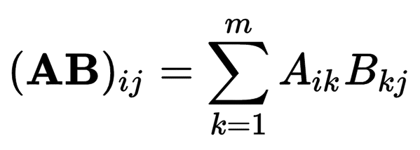

# Background and Architecture

## 1. Why Accelerate Matrix Multiplication?

Modern AI workloads are dominated by repeated multiply-and-accumulate operations. These operations appear in matrix multiplication, fully connected layers and convolution layers after the computation is transformed into GEMM-style operations.

For matrix multiplication:



each output element is a dot product between one row of matrix A and one column of matrix B.

General-purpose processors can execute this computation, but repeated instruction handling, cache behaviour and data movement introduce overhead. A domain-specific accelerator instead maps the repeated MAC structure directly into hardware.

Systolic arrays are well suited to this because they combine:

- regular computation,
- high parallelism,
- local communication between neighbouring processing elements,
- predictable data movement,
- repeated reuse of operands as data moves through the array.

---

## 2. Systolic Array Dataflows


A systolic array consists of a grid of processing elements, or PEs. Each PE performs arithmetic on incoming operands and forwards data to neighbouring PEs.

Different dataflows decide which value is retained inside the PE and which values move.

| Dataflow | Stationary value | Main advantage |
|---|---|---|
| Output stationary | Partial sum | Reduces partial-sum movement |
| Weight stationary | Weight | Maximises weight reuse |
| Input stationary | Input activation | Maximises input reuse |

The best dataflow depends on workload characteristics.

### Output Stationary

OS8 uses output-stationary dataflow.

During computation:

- matrix A values enter from the left,
- matrix B values enter from the top,
- A moves horizontally,
- B moves vertically,
- the accumulated output associated with each PE remains local during the compute phase.

[Figure 2.5 from report — Dataflow in a 4×4 output-stationary systolic array]

This is conceptually different from system-level B reuse. The PE array remains output stationary even when software chooses to load one B tile once and reuse it for several A matrices.

### Weight Stationary and Input Stationary

The report also compares weight-stationary and input-stationary dataflows.

Weight stationary is attractive when the same weights are reused repeatedly. Input stationary is attractive when activations are reused repeatedly.

[Figure 2.6 from report — Weight-stationary dataflow]

[Figure 2.7 from report — Input-stationary dataflow]

The comparison demonstrates that dataflow efficiency is workload-dependent rather than universal.

---

## 3. Why OS8 Uses an 8×8 Array

The project uses an 8×8 physical array.

This gives:

```text
8 × 8 = 64 processing elements
```

The fixed tile size keeps the hardware compact and easy to verify while allowing larger matrix sizes to be handled through software tiling.

The accelerator accepts signed INT8 operands and performs 32-bit accumulation.

The processor software handles:

- matrix dimensions larger than 8×8,
- tile creation,
- zero-padding,
- repeated tile invocation,
- accumulation across tile groups.

This creates a clear hardware/software split:

```text
RocketCore / software
    ↓
tiling, padding, scheduling
    ↓
fixed 8×8 accelerator
```

---

## 4. Overall System Architecture

The accelerator is attached to a RISC-V RocketCore through the Rocket Custom Coprocessor interface.

The complete system contains:

- RocketCore,
- cache/memory hierarchy,
- RoCC interface,
- OS8 accelerator.

[Figure 3.2 from report — Overall system architecture]

RocketCore remains responsible for general program execution and workload orchestration.

OS8 performs the matrix-multiplication kernel.

The accelerator accesses data through the system memory path and returns completion information to the processor through RoCC.

---

## 5. OS8 Hardware Hierarchy

The SystemVerilog accelerator is structured as:

```text
os8_wrapper
├── os8_rocc_cmd_regs
├── os8_controller
├── os8_activation_unit
└── os8_sa
    ├── os8_delay_mem ×2
    ├── os8_pe_mesh
    │   └── os8_pe ×64
    └── os8_final_cpa ×8
```

[Figure 3.5 from report — Communication between modules in the accelerator]

### `os8_wrapper`

This is the top-level SystemVerilog boundary.

It connects:

- RoCC command signals,
- RoCC response signals,
- memory requests,
- memory responses,
- accelerator busy status.

The wrapper mainly routes signals between the external interface and internal accelerator blocks.

### `os8_rocc_cmd_regs`

This block receives decoded RoCC command fields and stores accelerator configuration.

It maintains:

- A pointer,
- B pointer,
- C pointer,
- response register destination,
- ReLU enable,
- shift amount,
- operating mode.

It also generates the one-cycle start pulse used by the controller.

### `os8_controller`

The controller is the system-level sequencer.

It handles:

- loading A,
- loading B,
- retaining loaded operand tiles,
- starting the compute core,
- waiting for completion,
- selecting C elements,
- applying output processing,
- storing C,
- returning the response,
- collecting cycle information.

The ability to separate load, compute and store phases is what makes explicit operand reuse possible.

### `os8_activation_unit`

The activation block performs:

1. arithmetic right shift,
2. optional ReLU.

Conceptually:

```text
shifted = in_data >>> shift_amount

if ReLU enabled and shifted < 0:
    out_data = 0
else:
    out_data = shifted
```

### `os8_sa`

`os8_sa` is the main compute core.

It:

- receives complete 8×8 A and B tiles,
- transposes B internally,
- feeds A and B through staggered delay memories,
- controls the PE mesh,
- propagates completed carry-save results,
- performs final CPA conversion,
- produces output matrix C,
- asserts done.

---

## 6. Generating the Systolic Wavefront

Correct systolic operation requires the right A and B values to arrive at a PE on the same cycle.

If every matrix row and column were injected simultaneously, many operands would meet at the wrong locations.

OS8 therefore uses two `os8_delay_mem` instances.

One handles A.

One handles the transposed B matrix.

The staggered streams conceptually look like:

```text
A row 0:  A00 A01 A02 A03 ...
A row 1:      A10 A11 A12 ...
A row 2:          A20 A21 ...
A row 3:              A30 ...
```

This creates a diagonal wavefront through the array.

The B stream is skewed in the corresponding direction so that each PE receives the intended `A[i][k]` and `B[k][j]` pair.

---

## 7. Processing Element Architecture

Each PE receives:

- signed INT8 A,
- signed INT8 B,
- control signals,
- carry-save propagation input from the PE above.

The PE:

1. multiplies A and B,
2. sign-extends the product,
3. accumulates using carry-save representation,
4. stores the result in one of two internal carry-save banks.

The PE array therefore does not perform a full carry-propagate addition on every accumulation cycle.

### CPA-Factored Accumulation

A simple MAC would conceptually use:

```text
accumulator = accumulator + A × B
```

which requires carry propagation through a wide adder during repeated accumulation.

OS8 instead keeps the result as:

```text
sum
carry
```

during the compute phase.

A normal binary result is only produced later:

```text
result = sum + carry
```

using the final CPA.

This moves the full carry-propagate operation out of the repeated accumulation path.

### Dual Carry-Save Banks

Each PE has two carry-save banks.

The selected roles are controlled using `prop_sel`.

One bank can be used for computation while the other is used for output propagation.

During the result phase, `prop_shift` causes the selected carry-save result to move downward through the PE column.

At the bottom of the mesh:

```text
bottom_sum
bottom_carry
```

are passed to `os8_final_cpa`.

### Final Carry-Propagate Addition

`os8_final_cpa` performs:

```text
result_out = sum_in + carry_in
```

One CPA is generated for each output column.

The converted results are captured into C.

---

## 8. Architectural Summary

The OS8 datapath therefore combines:

- output-stationary systolic dataflow,
- 64 parallel PEs,
- signed INT8 multiplication,
- 32-bit accumulation,
- carry-save accumulation,
- dual carry-save banks,
- final CPA factoring,
- software-managed 8×8 tiling.

The design intentionally remains compact enough that the complete path from instruction to PE arithmetic can be understood and inspected directly.

For processor integration and execution behaviour, continue to:

[Processor Integration, Operation and Verification](02-integration-operation-and-verification.md)
