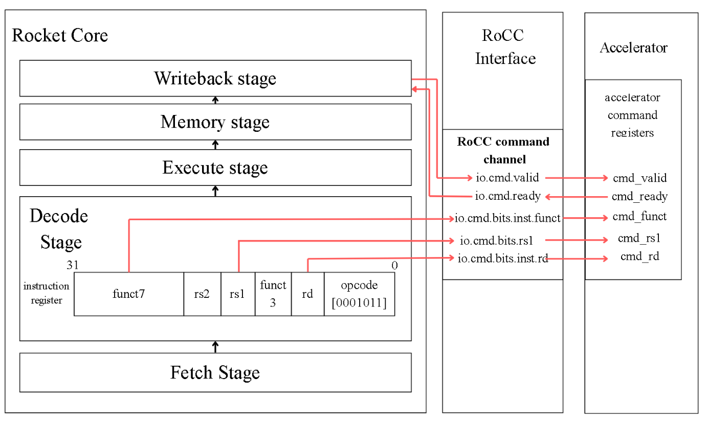

# RocketCore Integration, Operation and Verification

## 1. RocketCore and RoCC

The accelerator is integrated into RocketCore through the Rocket Custom Coprocessor interface.

RoCC allows custom RISC-V instructions to invoke a tightly coupled accelerator while RocketCore remains responsible for normal program execution.

The software path is:

```text
C program
    ↓
custom RISC-V instruction
    ↓
RocketCore decode
    ↓
RoCC command channel
    ↓
OS8 command registers
    ↓
OS8 controller
    ↓
systolic datapath
```



### Command Fields

The accelerator uses the `custom0` opcode space.

The important fields are:

- `funct7` — command selector,
- `rs1` — pointer or configuration value,
- `rd` — destination register when a response is required,
- `rs2` — unused,
- `funct3` — fixed to `000`.

At the accelerator boundary:

```text
funct7 → cmd_funct
rs1    → cmd_rs1
rd     → cmd_rd
```

A command is accepted when:

```text
cmd_valid && cmd_ready
```

are asserted together.

---

## 2. Custom Instruction Map

## RoCC Custom Instruction Encoding

The OS8 accelerator uses the RISC-V `custom0` opcode space for its RoCC commands.

| [31:25] funct7 | [24:20] rs2 | [19:15] rs1 | [14:12] funct3 | [11:7] rd | [6:0] opcode | Operation |
|---|---|---|---|---|---|---|
| `0000000` | unused | A buffer address source register | `000` | unused | `0001011` | Provide A tile buffer address |
| `0000001` | unused | B buffer address source register | `000` | unused | `0001011` | Provide B tile buffer address |
| `0000010` | unused | C output tile address source register | `000` | unused | `0001011` | Provide C output tile buffer address |
| `0000011` | unused | unused | `000` | response destination register | `0001011` | Load A, load B, compute, store C |
| `0000111` | unused | activation configuration source register | `000` | unused | `0001011` | Configure activation unit |
| `0001000` | unused | unused | `000` | response destination register | `0001011` | Load A tile only |
| `0001001` | unused | unused | `000` | response destination register | `0001011` | Load B tile only |
| `0001010` | unused | unused | `000` | response destination register | `0001011` | Compute stored A and B tile |
| `0001011` | unused | unused | `000` | response destination register | `0001011` | Store computed C tile only |
| `0001100` | unused | unused | `000` | response destination register | `0001011` | Load A and B tiles only |
| `0001101` | unused | unused | `000` | response destination register | `0001011` | Compute and store C tile only |

The separated operating modes are important because they allow the accelerator to keep one operand resident while another operand changes.

---

## 3. Complete Operation Flow

The overall execution sequence is:

1. Software creates the workload.
2. The matrix is divided into 8×8 tiles.
3. Incomplete tiles are zero-padded.
4. Software provides A, B and C addresses.
5. Optional activation configuration is sent.
6. An execution command is issued.
7. The controller loads the required matrices.
8. `os8_sa` starts the systolic computation.
9. The PE mesh performs the MAC operations.
10. Completed carry-save results propagate to the final CPA stage.
11. C values are captured.
12. Arithmetic shift and optional ReLU are applied.
13. C is written to memory.
14. A RoCC response is returned.
15. Software schedules the next tile if required.

[Figure 3.3 from report — Operation flow of RoCC-integrated accelerator]

This division keeps the hardware fixed while allowing software to support arbitrary matrix dimensions.

---

## 4. Matrix Tiling and Zero Padding

The physical array always processes an 8×8 tile.

For a matrix smaller than 8×8:

```text
valid values + zeros → complete 8×8 tile
```

For larger matrices, software repeatedly creates A and B tiles.

For an incomplete edge tile, unused entries are set to zero so that the hardware does not need variable-size control logic.

This simplifies RTL at the cost of some wasted computation at partially occupied edges.

The tiling behaviour is also responsible for the repeated speedup pattern discussed in the performance documentation.

---

## 5. B-Matrix Reuse

The baseline operation is:

```text
Load A
Load B
Compute
Store C
```

for each tile operation.

The separated commands allow:

```text
Load B once

Load A1
Compute + Store

Load A2
Compute + Store

Load A3
Compute + Store
```

The same B tile remains stored inside the accelerator.

This models an inference-style workload where the same weights are applied to multiple input activation matrices.

This reuse is a controller/software-level optimisation.

It does **not** convert the PE array from output-stationary to weight-stationary dataflow.

---

## 6. Scala / Chisel Integration

The SystemVerilog accelerator is attached to Rocket Chip through a thin Scala/Chisel layer.

### `os8_matmul.scala`

Defines the RoCC accelerator at tile level.

It connects the Rocket-side RoCC:

- command channel,
- response channel,
- memory path,
- busy signal,

to the SystemVerilog blackbox.

### `os8_wrapper.scala`

Declares the Chisel `BlackBox` corresponding to `os8_wrapper.sv`.

It exposes the SystemVerilog ports to the Rocket/Chisel environment.

### `Configs.scala`

Defines the `BuildRoCC` attachment and connects OS8 using `OpcodeSet.custom0`.

### `RocketConfigs.scala`

Defines the final RocketCore configuration containing the OS8 accelerator.

The project originally placed these files under the relevant Chipyard/Rocket Chip source directories, while this repository groups them by function for readability.

---

## 7. Verification Strategy

Verification was carried out in layers.

```text
individual RTL module
        ↓
integrated hardware blocks
        ↓
complete RocketCore + RoCC + OS8 system
        ↓
software reference comparison
```

This makes debugging easier because each hardware block is checked before relying on full system integration.

---

## 8. Module-Level Verification

The following RTL blocks were verified individually:

- `os8_pe`
- `os8_activation_unit`
- `os8_final_cpa`
- `os8_delay_mem`
- `os8_pe_mesh`
- `os8_sa`
- `os8_rocc_cmd_regs`
- `os8_controller`

### PE Verification

The PE test cases include:

- clear behaviour,
- positive multiplication,
- signed multiplication,
- carry-save propagation.

Examples include:

```text
3 × 4 → 12
-2 × 5 → -10
77 + 3 propagation pair → 80
```

[Figure 4.1 from report — Annotated waveform for `os8_pe.sv`]

### Activation Verification

The activation unit tests:

```text
64 >>> 0 = 64
64 >>> 2 = 16
-32 >>> 1 = -16
ReLU(-16) = 0
```

[Figure 4.2 from report — Annotated waveform for `os8_activation_unit.sv`]

### Final CPA Verification

The final CPA is checked with:

- positive addition,
- larger values,
- negative two's-complement values,
- wraparound behaviour.

[Figure 4.3 from report — Annotated waveform for `os8_final_cpa.sv`]

### Delay-Memory Verification

The delay-memory tests confirm that matrix lanes appear at the output with progressively increasing delays.

This verifies the staggered wavefront.

[Figure 4.4 from report — Annotated waveform for `os8_delay_mem.sv`]

### PE Mesh Verification

The PE mesh is tested with a reduced configuration so that the bottom carry-save output can be checked directly.

[Figure 4.5 from report — Annotated waveform for `os8_pe_mesh.sv`]

### Systolic Core Verification

`os8_sa` is tested using complete matrix multiplications.

The cases include:

- identity matrix,
- normal positive multiplication,
- signed multiplication,
- zero matrix.

[Figure 4.6 from report — Annotated waveform for `os8_sa.sv`]

### Command Register Verification

The command register tests verify:

- A pointer update,
- B pointer update,
- activation configuration,
- execution command decoding,
- operating mode,
- response register capture.

[Figure 4.7 from report — Annotated waveform for `os8_rocc_cmd_regs.sv`]

### Controller Verification

The controller test verifies:

- reset,
- A loading,
- B loading,
- signed byte interpretation,
- C stores,
- memory request and response sequencing.

[Figure 4.8 from report — Annotated waveform for `os8_controller.sv`]

---

## 9. System-Level Verification

After module-level verification, the full accelerator is tested in Chipyard using Verilator.

`os8_test.c` runs on the simulated RocketCore.

For each workload:

1. Software creates input matrices.
2. Normal C code computes a reference result.
3. RoCC commands invoke the accelerator.
4. OS8 computes and stores the hardware result.
5. Software compares both outputs element by element.

This verifies the entire path:

```text
software
→ RocketCore
→ custom instruction
→ RoCC
→ command registers
→ controller
→ memory
→ systolic array
→ output store
→ software comparison
```

The top-level `os8_wrapper` is therefore validated primarily through this end-to-end execution rather than only through a standalone wrapper waveform.

---

## 10. Benchmark and Functional Test Groups

The software includes three matrix-size sweep benchmarks:

- Type 1A — 1×1 to 32×32, no explicit B reuse,
- Type 1B — same sweep with 5× B reuse,
- Type 1C — same sweep with 10× B reuse.

All three groups pass:

```text
32 / 32
```

correctness tests.

The software also contains 8×8 CNN-style tests using patterns such as:

- random signed INT8 values,
- 4-bit-style values,
- sparse matrices,
- identity matrices,
- external weights,
- ReLU,
- arithmetic right shift.

This extends verification beyond simple dense positive matrix multiplication.

---

## 11. Verification Summary

The project therefore verifies the design at three levels:

### Arithmetic / Module Level

Individual behaviour of PE arithmetic, final addition, activation and delay structures.

### Control / Integration Level

Command decoding, controller FSM, memory requests and systolic-core sequencing.

### System Level

Software-generated matrices, RocketCore execution, RoCC invocation and hardware/software result comparison.

The benchmark and performance behaviour of the validated system is discussed in:

[Performance, Scalability and Synthesis](03-performance-scalability-and-synthesis.md)
