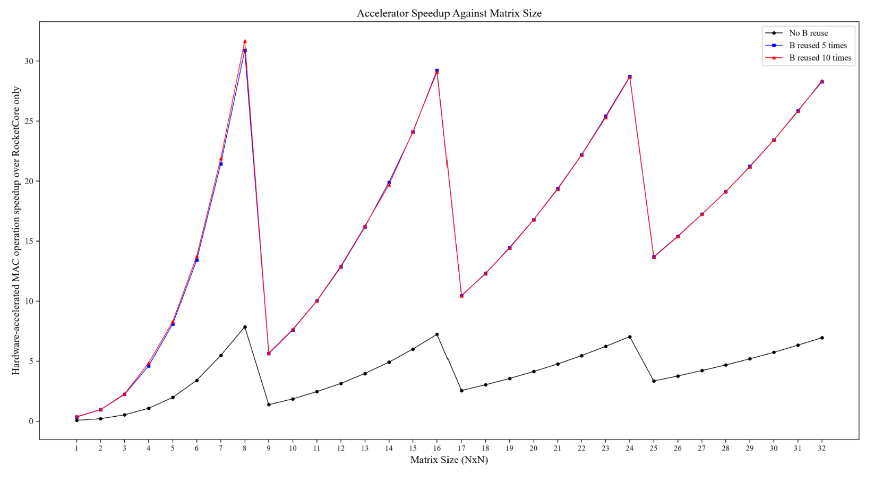

# Performance, Scalability and Synthesis

## 1. System-Level Benchmark Results

The accelerator was benchmarked using square matrix sizes from 1×1 through 32×32.

Software execution uses normal C matrix multiplication.

Hardware execution includes the RoCC-controlled accelerator path.

The measured aggregate results were:

| Configuration | Software cycles | Hardware cycles | Overall speedup | Correctness |
|---|---:|---:|---:|---:|
| No explicit B reuse | 3,222,602 | 672,021 | 4.79× | 32 / 32 |
| B reused 5× | 16,251,427 | 898,490 | 18.08× | 32 / 32 |
| B reused 10× | 32,522,591 | 1,791,535 | 18.15× | 32 / 32 |

[Table 4.9 from report — Summary of system-level verification and benchmarking]



The baseline case achieves 4.79× overall speedup.

Explicit B reuse increases the measured speedup to approximately 18×.

This demonstrates that data movement is a major system-level cost.

---

## 2. Why Small Matrices Perform Poorly

The accelerator has fixed overhead:

- command issue,
- memory loads,
- systolic-array fill,
- computation,
- output propagation,
- store operations.

For a very small matrix, there are few useful MAC operations.

The fixed overhead therefore forms a large fraction of total hardware time.

This is why very small matrix sizes may have low speedup even though the hardware contains 64 parallel PEs.

---

## 3. Why the Speedup Curve Is Sawtooth-Shaped

The physical array is fixed at 8×8.

Within a tile region, larger matrices use more of the available compute work, so speedup tends to rise.

When a matrix dimension crosses a new multiple-of-eight boundary, additional tile operations are required.

The new edge tiles may initially contain many zero-padded or unused entries.

Hardware cycles therefore increase sharply while useful arithmetic increases only slightly.

This causes the speedup to drop before rising again.

Multiples of eight tend to be favourable because they align directly with the physical tile dimensions:

```text
8
16
24
32
```

---

## 4. Why B Reuse Produces a Large Improvement

Without reuse:

```text
Load A
Load B
Compute
Store
```

is repeated.

With B reuse:

```text
Load B once

Load A1 → Compute → Store
Load A2 → Compute → Store
Load A3 → Compute → Store
...
```

The repeated B-loading cost is removed.

The move from 4.79× to approximately 18× shows that keeping the weight operand resident has a large impact on realised system performance.

The difference between 5× and 10× reuse is small:

```text
18.08×
18.15×
```

because most B-loading overhead has already been amortised by 5× reuse.

After that point, performance is dominated by:

- A loading,
- command handling,
- compute,
- output propagation,
- C stores.

This is an example of bottleneck migration: once one overhead is reduced, the remaining overheads become dominant.

---

## 5. Peak Arithmetic Throughput

OS8 contains:

```text
64 PEs
```

Each PE can perform one MAC per active compute cycle.

Therefore:

```text
64 MAC/cycle
```

If one MAC is counted as two operations:

```text
64 × 2 = 128 operations/cycle
```

At the approximately 700 MHz synthesis target:

```text
128 × 700 MHz = 89.6 GOPS
```

So the theoretical peak arithmetic throughput is:

```text
89.6 GOPS
```

under the two-operations-per-MAC convention.

This is a peak array figure, not sustained application throughput.

Real execution also includes memory movement, command overhead, fill/drain cycles, activation and stores.

---

## 6. Scalability with Larger Arrays

For an N×N array:

```text
PE count = N²
MAC throughput = N² MAC/cycle
```

At the same 700 MHz frequency:

| Array size | PEs | MAC/cycle | Theoretical peak |
|---|---:|---:|---:|
| 8×8 | 64 | 64 | 89.6 GOPS |
| 16×16 | 256 | 256 | 358.4 GOPS |
| 32×32 | 1,024 | 1,024 | 1.4336 TOPS |

These values are ideal arithmetic peaks.

They assume:

- the same frequency can be maintained,
- the memory system can supply enough operands,
- physical routing remains manageable.

Scaling the array alone does not guarantee proportional system speedup.

---

## 7. What Becomes the Bottleneck as the Array Grows

### Area

PE count grows quadratically.

A 16×16 array has four times as many PEs as an 8×8 array.

A 32×32 array has sixteen times as many.

### Memory Bandwidth

A larger array consumes more A and B values per cycle.

Eventually:

```text
compute capability > data delivery capability
```

and the array becomes memory-bound.

### Routing and Timing

A larger physical array has:

- longer wires,
- greater clock-distribution complexity,
- more control fanout,
- more edge-routing demand.

### Utilisation

A larger array is only efficient when the workload is large enough to fill it.

For small matrices, a bigger array can waste more hardware.

---

## 8. Scaling with SRAM Macros

The current 8×8 design intentionally uses simple local storage structures suitable for direct RTL verification.

For larger designs, storing large operand buffers in flip-flops becomes inefficient.

A scalable architecture would use SRAM macros or a local SRAM-backed scratchpad.

Conceptually:

```text
RocketCore / RoCC
       │
       ▼
System memory path
       │
       ▼
+-----------------------+
| Local SRAM Scratchpad |
|                       |
| A banks               |
| B / weight banks      |
| C / output banks      |
+-----------+-----------+
            │
            ▼
        N × N array
```

SRAM enables:

- larger local working sets,
- denser storage,
- larger weight reuse windows,
- multiple buffered tiles,
- reduced repeated traffic to shared memory.

The current 5× and 10× B-reuse benchmarks already demonstrate why local weight residency matters.

---

## 9. Banked SRAM

Capacity alone is not enough.

A large array requires high bandwidth.

A single SRAM bank may not be able to supply enough operands per cycle.

A future implementation could use:

```text
A SRAM
├── bank 0
├── bank 1
├── ...
└── bank N-1

B SRAM
├── bank 0
├── bank 1
├── ...
└── bank N-1
```

The banking scheme would depend on:

- SRAM width,
- array size,
- port count,
- tile organisation,
- target frequency.

The key requirement is that storage bandwidth must scale together with compute throughput.

---

## 10. Double Buffering

A future SRAM-backed implementation could overlap data movement with computation.

Without buffering:

```text
LOAD
COMPUTE
LOAD
COMPUTE
```

With double buffering:

```text
Buffer 0: LOAD tile 0 → COMPUTE tile 0 → LOAD tile 2
Buffer 1:               LOAD tile 1 → COMPUTE tile 1
```

This reduces idle periods between tile computations.

The faster the PE array becomes, the more important this overlap becomes.

---

## 11. Technology-Node Scaling

The current implementation was synthesized using the SAED32nm LVT standard-cell library.

A more advanced technology node could potentially provide:

- higher transistor density,
- smaller standard cells,
- potentially higher frequency,
- more on-chip SRAM capacity,
- lower energy per operation in a well-optimised implementation.

A smaller node can be used in several ways.

### Keep the Same 8×8 Array

The existing architecture could potentially occupy less area and target a higher frequency.

For an 8×8 array:

| Frequency | Ideal peak |
|---:|---:|
| 500 MHz | 64 GOPS |
| 700 MHz | 89.6 GOPS |
| 1.0 GHz | 128 GOPS |
| 1.5 GHz | 192 GOPS |
| 2.0 GHz | 256 GOPS |

These are arithmetic projections, not guaranteed implementation frequencies.

### Use the Extra Density for a Larger Array

At 1 GHz:

```text
16×16:
256 MAC/cycle × 2 × 1 GHz
= 512 GOPS

32×32:
1024 MAC/cycle × 2 × 1 GHz
= 2.048 TOPS
```

Again, these values assume enough memory bandwidth.

### Use the Extra Density for SRAM

For a memory-bound workload, using more area for SRAM can be more valuable than increasing PE count.

Possible additions include:

- larger resident weight buffers,
- banked scratchpads,
- prefetch buffers,
- double buffering,
- larger output buffers.

The B-reuse benchmark suggests that this kind of memory optimisation can produce very large system-level gains.

---

## 12. Why a Better Node Does Not Solve Everything

Process scaling does not automatically eliminate:

- SRAM latency,
- interconnect delay,
- controller critical paths,
- memory bandwidth limits,
- clock distribution,
- routing congestion,
- power density.

The current synthesis already demonstrates this effect.

The critical path is reported in the controller memory-address generation path rather than inside the PE MAC datapath.

So future scaling should combine:

```text
better technology
+
larger compute
+
better memory
+
better control
```

rather than relying only on transistor scaling.

---

# 13. Synthesis Results

The complete accelerator was synthesized with `os8_wrapper` as the top level.

## Setup

- Tool: Synopsys Design Compiler
- Library: SAED32nm LVT
- Target period: 1.43 ns
- Target frequency: approximately 700 MHz

The synthesis includes the full accelerator hierarchy, not just the PE mesh.

## Area

| Metric | Result |
|---|---:|
| Cell count | 62,343 |
| Combinational cells | 44,651 |
| Sequential cells | 16,754 |
| Total cell area | 240,619.98 |
| Total area including estimated interconnect | 281,560.63 |

## Timing

| Metric | Result |
|---|---:|
| Target period | 1.43 ns |
| Target frequency | approximately 700 MHz |
| Slack | 0.00 ns |
| Status | MET |

The reported critical path is located in the controller memory-address generation path.

This is important because the limiting path is not directly the PE arithmetic.

## Power

| Metric | Result |
|---|---:|
| Cell internal power | 7.8790 mW |
| Net switching power | 1.1095 mW |
| Dynamic power | 8.9885 mW |
| Leakage power | 369.2892 mW |
| Total estimated power | approximately 378.28 mW |


Leakage dominates the estimate, which is consistent with the use of an LVT standard-cell library.

These values are synthesis estimates, not fabricated-silicon or post-layout measurements.

---

# 14. Overall Interpretation

The project demonstrates performance optimisation at three levels.

### Arithmetic

Carry-save accumulation reduces repeated full carry propagation inside the PE accumulation loop.

### Array

The 8×8 output-stationary array provides 64 parallel MAC units.

### System

RoCC integration and explicit operand reuse reduce software and memory overhead.

[Performance and PPA summary section from poster]

The most important future scaling direction is therefore not simply “more PEs”.

A stronger next-generation design would combine:

- larger arrays,
- SRAM macros,
- larger weight residency,
- banked memory,
- double buffering,
- higher memory bandwidth,
- improved controller timing,
- more advanced technology nodes.

That combination is what allows theoretical compute throughput to become sustained system-level performance.

---

## Important Note

The larger-array and higher-frequency values in this document are theoretical architectural projections.

Actual results would require:

- new synthesis,
- SRAM macro selection,
- place and route,
- timing closure,
- physical power analysis,
- realistic memory-system modelling.

The reported 32 nm results are specific to the synthesis setup used in this project.
